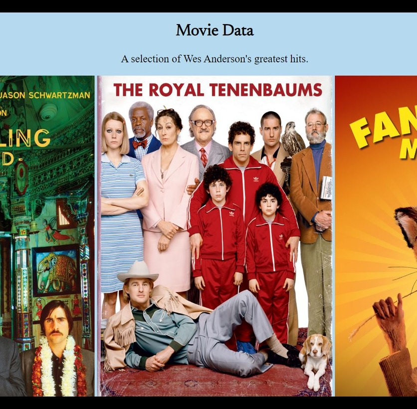

# Project Feature 

For my project feature, I wanted to create something that would be achievable for me as a relative beginner to coding, but would still push me to accomplish something new. With my interests in video games, skateboarding, music and 3d art, I wanted to create something which would be quite eye catching, and after researching a bit into what would be most suitable, I decided on a 3d spinner-type gallery. Not only did this fit my creative capacity, I felt it was also something which I didn't often see on feature-led websites. It would be a great option to house my projects in an interesting way, also accomplishing some of the requirements from the Website project. With this decided on, I proceeded to plan the feature out.

## Planning

For the feature, I want to firstly take a selection of images of my projects and display these within a gallery. This entails creating a container to house the images and specific classes to identify this group of images when it comes to writing the scripts to animate it three dimensionally. Usage of a `section` and `div` element would be good for this; the section to contain the images with a div also housing the images and representing the "spinner" element of the gallery. 

The gallery needs two clickable `buttons` for navigating left and right, and below the gallery I want to house a description of the projects I have completed. For this I will use another button and call a function via an event listener which, after being clicked, will create and display the description inside a `div` container. This will provide my website with DOM event listeners as well as DOM updates in response to user interaction.

I will need to include specific styles for the spinner which mean it stays in view whilst giving a good perspective of the images whilst being turned. Within the style sheet I will also specify the angles needed to be turned in the 3d gallery with each button click to complete a full 360' spin.

As mentioned, I will need a function which displays a description of my projects once a button is clicked. The left and right buttons will also need event listeners to ensure they perform a function to move the image gallery along when clicked. In addition, as I am rotating the gallery 360' to display all of my projects I will need to specify functions which allow the gallery to advance in increments which align centrally to each gallery item.


## Building

### HTML

To start with, I will populate the html file with the container element (including container and spinner) and my images;

```html
<section class="spinner-container">
    <div class="spinner">
        
        
        
        
        
        
</section>
```

I specify individual sources for each image, housed in my main folder, and give each image a `class="spinner-img"` and `height="550px" width "700px"` to standardise each for when I come to my style sheet and scripts. Next are the aforementioned buttons;

```html
<span id="button1" style="float: left;">&lt;</span>
<span id="button2" style="float: right;">&gt;</span>

<div class="spinner-holder">
<button id="spinner-info">Click to Find out More</button>
</div>
```

Giving each `button` a float property with adirection allows them both to sit at the edges of their container, making them look more aesthetically pleasing and functional. Finally I create a `div` to hold the information I will create in my Javascript file;

```html
<div class="info-holder">
</div>
```

And build a list of project links to fulfil the requirements of the website project;

```html
<div class="projects-links">
    <li><a href="https://malcolmwilson8.github.io/my-webpage/">Project 1 - Hobby Page</a></li>
    <li><a href="https://malcolmwilson8.github.io/project-gallery/">Project 2 - Project Gallery</a></li>
    <li><a href="https://malcolmwilson8.github.io/comment-box/">Project 3 - Comment Box</a></li>
    <li><a href="https://malcolmwilson8.github.io/movie-data/">Project 4 - Movie Data</a></li>
    <li><a href="https://malcolmwilson8.github.io/my-webpage/">Project 5 - Website</a></li>
    <li><a href="https://malcolmwilson8.github.io/feature//">Project 5 - 3d Gallery</a></li>
</div>
```

### CSS

Moving onto CSS, I need to ensure that the spinner container displays the images it is housing correctly through correct perspective and also that it offsets direction at the correct x, y, and z locations;

.spinner-container{
    perspective: 900px;
    transform-origin: 50% 50% -500px;
    transition: 1s
}


## Debugging
